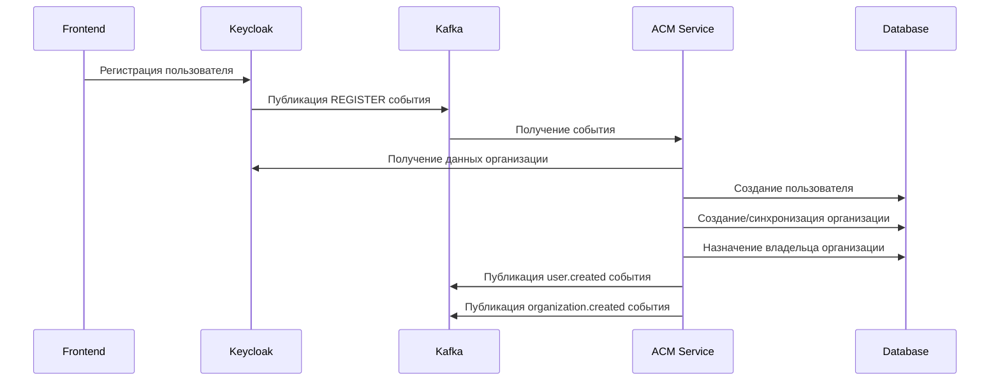

# 🔐 Access Control Management (ACM) Service

Сервис управления доступом для IoT-Hub платформы

[](https://www.typescriptlang.org/)
[](https://nestjs.com/)
[](https://www.postgresql.org/)
[](https://kafka.apache.org/)
[](https://www.keycloak.org/)

## 📋 Описание

ACM (Access Control Management) - это микросервис, отвечающий за управление пользователями, организациями и правами доступа в экосистеме IoT-Hub. Сервис обеспечивает централизованное управление аутентификацией и авторизацией, интегрируясь с Keycloak и обрабатывая события через Apache Kafka.

## 🏗️ Архитектура

### 🔧 Основные компоненты

- **User Management** - Управление пользователями и их профилями
- **Organization Management** - Управление организациями и членством
- **Permissions & Roles** - Система ролей и разрешений (RBAC)
- **Keycloak Integration** - Синхронизация с провайдером аутентификации
- **Kafka Events** - Обработка и публикация событий

### 🗄️ База данных

Сервис использует централизованную схему базы данных из `@iot-hub/shared`:

- **users** - Пользователи системы
- **organizations** - Организации
- **groups** - Группы пользователей
- **devices** - IoT устройства
- **certificates** - Сертификаты для mTLS

## 🚀 Быстрый старт

### 📋 Предварительные требования

- Node.js 18+
- PostgreSQL 15+
- Apache Kafka 3.5+
- Keycloak 22+
- Redis 7+

### 🔧 Установка

```bash
# Клонирование репозитория
git clone https://github.com/IfNoise/iot-hub.git
cd iot-hub

# Установка зависимостей
npm install

# Запуск базы данных и сервисов
docker-compose up -d postgres redis kafka keycloak

# Выполнение миграций базы данных
cd libs/shared && npm run migrate

# Сборка проекта
nx build acm

# Запуск в режиме разработки
nx serve acm
```

### 🌐 Переменные окружения

Создайте файл `.env` в директории `apps/acm/`:

```env
# Основные настройки
NODE_ENV=development
PORT=3001

# База данных
DATABASE_HOST=localhost
DATABASE_PORT=5434
DATABASE_USER=iot_user
DATABASE_PASSWORD=iot_password
DATABASE_NAME=iot_hub

# JWT
JWT_SECRET=your-super-secret-development-key-32-chars-long
JWT_EXPIRATION=1h

# Redis
REDIS_URL=redis://localhost:6379
REDIS_ENABLED=true

# Kafka
KAFKA_BROKERS=localhost:9092
KAFKA_CLIENT_ID=acm
KAFKA_GROUP_ID=acm-group
KAFKA_ENABLED=true

# Keycloak
KEYCLOAK_BASE_URL=http://localhost:8080
KEYCLOAK_REALM=iot-hub
KEYCLOAK_CLIENT_ID=acm-service
KEYCLOAK_CLIENT_SECRET=your-client-secret
```

## 🎯 API Endpoints

### 👥 Пользователи

```http
GET    /api/users              # Список пользователей
GET    /api/users/:id          # Информация о пользователе
POST   /api/users              # Создание пользователя
PATCH  /api/users/:id          # Обновление пользователя
DELETE /api/users/:id          # Удаление пользователя
GET    /api/users/:id/permissions    # Разрешения пользователя
POST   /api/users/:id/has-permission # Проверка разрешения
```

### 🏢 Организации

```http
GET    /api/organizations      # Список организаций
GET    /api/organizations/:id  # Информация об организации
```

### 👥 Группы

```http
GET    /api/groups             # Список групп
POST   /api/groups             # Создание группы
GET    /api/groups/:id         # Информация о группе
PATCH  /api/groups/:id         # Обновление группы
DELETE /api/groups/:id         # Удаление группы
GET    /api/groups/:id/members # Участники группы
POST   /api/groups/:id/members # Добавление участника
```

### 🔄 Синхронизация

```http
POST   /api/sync/user          # Синхронизация пользователя с Keycloak
```

### 🏥 Здоровье сервиса

```http
GET    /api/health             # Статус сервиса
```

## 🔄 События Kafka

### 📨 Подписки (Consumer)

Сервис подписан на следующие топики:

- `auth.events.v1` - События аутентификации из Keycloak
- `user.events.v1` - События пользователей
- `organization.events.v1` - События организаций

### 📤 Публикации (Producer)

Сервис публикует события в топики:

- `user.events.v1` - События создания/обновления пользователей
- `organization.events.v1` - События создания/обновления организаций

### 🎭 Обрабатываемые события

#### Keycloak Events

- **REGISTER** - Регистрация нового пользователя
- **LOGIN** - Вход пользователя
- **LOGOUT** - Выход пользователя
- **UPDATE_PROFILE** - Обновление профиля
- **DELETE_ACCOUNT** - Удаление аккаунта

## 🔌 Интеграция с Keycloak

Сервис автоматически синхронизируется с Keycloak:

1. **События пользователей** - Создание/обновление пользователей при регистрации
2. **Организации** - Синхронизация организаций и членства
3. **Service Account** - Использование сервисного аккаунта для API вызовов
4. **Обработка ошибок** - Graceful handling недоступности Keycloak

## 🗃️ Схема базы данных

ACM сервис использует **оптимизированную схему** из `@iot-hub/shared`, содержащую только **3 необходимые таблицы**:

> ⚡ **Оптимизация**: Исключены таблицы `devices` и `certificates`, которые используются в других микросервисах

### Users Table

```sql
CREATE TABLE users (
  id UUID PRIMARY KEY DEFAULT gen_random_uuid(),
  user_id VARCHAR(255) NOT NULL UNIQUE,      -- Keycloak user ID
  email VARCHAR(255) NOT NULL UNIQUE,
  name VARCHAR(100) NOT NULL,
  avatar VARCHAR(500),                       -- URL to avatar
  roles JSONB NOT NULL DEFAULT '[]',         -- Array of roles
  balance DECIMAL(10,2) NOT NULL DEFAULT 0.00,
  plan VARCHAR(20) NOT NULL DEFAULT 'free',  -- PlanTypeEnum
  plan_expires_at TIMESTAMP,
  account_type VARCHAR(20) NOT NULL DEFAULT 'individual', -- UserTypeEnum
  organization_id UUID,                      -- Reference to organizations
  groups JSONB,                             -- Array of group IDs
  metadata JSONB,                           -- Additional metadata
  created_at TIMESTAMP NOT NULL DEFAULT now(),
  updated_at TIMESTAMP NOT NULL DEFAULT now(),
  deleted_at TIMESTAMP
);
```

### Organizations Table

```sql
CREATE TABLE organizations (
  id UUID PRIMARY KEY DEFAULT gen_random_uuid(),
  keycloak_id VARCHAR(255) NOT NULL UNIQUE, -- Keycloak organization ID
  name VARCHAR(255) NOT NULL,
  slug VARCHAR(100) NOT NULL UNIQUE,
  description TEXT,
  plan VARCHAR(20) NOT NULL DEFAULT 'free',
  plan_expires_at TIMESTAMP,
  max_users INTEGER DEFAULT 10,             -- Resource limits
  max_devices INTEGER DEFAULT 100,
  max_data_transfer_mb DECIMAL(15,2) DEFAULT 1000.00,
  current_users INTEGER DEFAULT 0,          -- Current usage
  current_devices INTEGER DEFAULT 0,
  current_data_transfer_mb DECIMAL(15,2) DEFAULT 0.00,
  contact_email VARCHAR(255),               -- Contact info
  billing_email VARCHAR(255),
  metadata JSONB,
  created_at TIMESTAMP NOT NULL DEFAULT now(),
  updated_at TIMESTAMP NOT NULL DEFAULT now(),
  deleted_at TIMESTAMP
);
```

### Groups Table

```sql
CREATE TABLE groups (
  id UUID PRIMARY KEY DEFAULT gen_random_uuid(),
  organization_id UUID NOT NULL,            -- Reference to organizations
  keycloak_id VARCHAR(255) NOT NULL UNIQUE, -- Keycloak group ID
  name VARCHAR(255) NOT NULL,
  slug VARCHAR(100) NOT NULL,
  description TEXT,
  max_users INTEGER,                        -- Resource limits (inherited if null)
  max_devices INTEGER,
  current_users INTEGER DEFAULT 0,          -- Current usage
  current_devices INTEGER DEFAULT 0,
  metadata JSONB,
  created_at TIMESTAMP NOT NULL DEFAULT now(),
  updated_at TIMESTAMP NOT NULL DEFAULT now(),
  deleted_at TIMESTAMP,
  UNIQUE(organization_id, slug)             -- Unique slug within organization
);
```

> 📋 **Примечание**: Таблицы `devices` и `certificates` исключены из ACM сервиса и управляются соответствующими специализированными микросервисами.

## 🔄 Workflow

### Регистрация нового пользователя



## 🧪 Тестирование

```bash
# Запуск всех тестов
nx test acm

# Запуск e2e тестов
nx e2e acm-e2e

# Запуск тестов с покрытием
nx test acm --coverage

# Линтинг
nx lint acm
```

## 📊 Мониторинг и логирование

### Логирование

Сервис использует структурированное логирование через Pino:

- **INFO** - Основные события и операции
- **DEBUG** - Детальная информация для отладки
- **WARN** - Предупреждения
- **ERROR** - Ошибки с stack trace

### Health Check

Endpoint `/api/health` возвращает статус сервиса и его зависимостей:

```json
{
  "status": "ok",
  "info": {
    "user-management-service": {
      "status": "up"
    }
  },
  "error": {},
  "details": {
    "user-management-service": {
      "status": "up"
    }
  }
}
```

## 🔧 Разработка

### Архитектурные принципы

- **Contract First** - API контракты определяются через `ts-rest`
- **Event-Driven** - Асинхронное взаимодействие через Kafka
- **Microservices** - Слабая связанность сервисов
- **CQRS** - Разделение команд и запросов
- **Single Source of Truth** - Централизованные схемы в `@iot-hub/shared`

### База данных и миграции

ACM использует **оптимизированную схему базы данных** с локальными миграциями:

```bash
# Генерация миграций только для ACM таблиц
npm run db:generate

# Запуск миграций
npm run db:migrate

# Альтернативный способ (через shared)
npm run migrate
```

**Преимущества локальных миграций:**

- 🚀 Быстрое развертывание (только 3 таблицы вместо 5)
- 📦 Минимальная схема базы данных
- 🔒 Изоляция от изменений в других сервисах
- ⚡ Оптимизированные индексы для ACM операций

### Зависимости

```json
{
  "@iot-hub/shared": "*",
  "@iot-hub/acm-contracts": "*",
  "@iot-hub/contracts-kafka": "*",
  "drizzle-orm": "^0.44.4",
  "kafkajs": "^2.2.4",
  "nestjs-pino": "^4.1.0"
}
```

## 🚀 Deployment

### Docker

```dockerfile
FROM node:18-alpine
WORKDIR /app
COPY package*.json ./
RUN npm ci --only=production
COPY dist/ ./dist/
EXPOSE 3001
CMD ["node", "dist/apps/acm/main.js"]
```

### Kubernetes

```yaml
apiVersion: apps/v1
kind: Deployment
metadata:
  name: acm-service
spec:
  replicas: 3
  selector:
    matchLabels:
      app: acm-service
  template:
    metadata:
      labels:
        app: acm-service
    spec:
      containers:
        - name: acm
          image: iot-hub/acm:latest
          ports:
            - containerPort: 3001
          env:
            - name: DATABASE_HOST
              value: 'postgres-service'
            - name: KAFKA_BROKERS
              value: 'kafka-service:9092'
```

## 🤝 Contributing

1. Fork репозиторий
2. Создайте feature branch (`git checkout -b feature/amazing-feature`)
3. Commit изменения (`git commit -m 'Add amazing feature'`)
4. Push в branch (`git push origin feature/amazing-feature`)
5. Создайте Pull Request

## 📝 License

Этот проект лицензирован под MIT License - см. файл [LICENSE](LICENSE) для деталей.

## 📞 Поддержка

Для вопросов и поддержки:

- 📧 Email: <noise8301@gmail.com>

---

**🔐 ACM Service - Secure. Scalable. Simple.**
