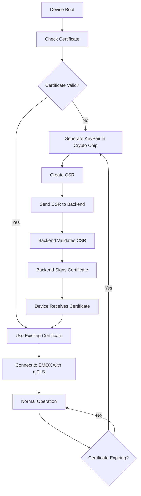

# 🔐 mTLS с CSR - Правильный PKI флоу

Документация по реализации правильного PKI флоу для IoT устройств с криптографическими чипами.

## 🎯 Архитектура CSR-based mTLS

```
┌─────────────────────┐    CSR      ┌─────────────────────┐    Signed    ┌─────────────────────┐
│   IoT Device        │──────────►  │   IoT Hub API       │─────Cert────►│   IoT Device        │
│                     │             │                     │              │                     │
│ ┌─────────────────┐ │             │ ┌─────────────────┐ │              │ ┌─────────────────┐ │
│ │ Crypto Chip     │ │             │ │ Certificate     │ │              │ │ Crypto Chip     │ │
│ │ - Gen KeyPair   │ │             │ │ Service         │ │              │ │ + Client Cert   │ │
│ │ - Create CSR    │ │             │ │ - Validate CSR  │ │              │ │ + CA Cert       │ │
│ │ - Store PrivKey │ │             │ │ - Sign with CA  │ │              │ │ - Private Key   │ │
│ └─────────────────┘ │             │ └─────────────────┘ │              │ └─────────────────┘ │
└─────────────────────┘             └─────────────────────┘              └─────────────────────┘
                                                                                   │
                                                                                   │ mTLS
                                                                                   ▼
                                                                         ┌─────────────────────┐
                                                                         │   EMQX Broker       │
                                                                         │                     │
                                                                         │ - Verify Client     │
                                                                         │ - Check CA Chain    │
                                                                         │ - Validate Status   │
                                                                         └─────────────────────┘
```

## 🔑 Принципы безопасности

### ✅ **Правильный подход (CSR-based)**

1. **Криптографический чип генерирует ключевую пару**

   - Приватный ключ **НИКОГДА** не покидает чип
   - Публичный ключ используется для создания CSR

2. **Устройство создает CSR**

   - Certificate Signing Request содержит публичный ключ
   - CSR подписан приватным ключом устройства
   - Содержит метаданные: device ID, firmware version, etc.

3. **Backend подписывает CSR**

   - Валидирует подпись CSR
   - Проверяет права устройства
   - Подписывает сертификат своим CA

4. **Устройство получает сертификат**
   - Приватный ключ остается в чипе
   - Сертификат сохраняется для mTLS
   - CA сертификат для валидации сервера

### ❌ **Неправильный подход (Auto-generation)**

1. Backend генерирует и ключ и сертификат
2. Передает приватный ключ по сети
3. Приватный ключ хранится в файловой системе
4. Высокий риск компрометации

## 🚀 Реализация

### **Backend API**

#### Подписание CSR

```http
POST /api/devices/certificates/{deviceId}/sign-csr

Content-Type: application/json
{
  "csrPem": "-----BEGIN CERTIFICATE REQUEST-----\n...\n-----END CERTIFICATE REQUEST-----",
  "firmwareVersion": "1.2.3",
  "hardwareVersion": "v2.1"
}
```

#### Ответ

```json
{
  "deviceId": "device-001",
  "clientCert": "-----BEGIN CERTIFICATE-----\n...\n-----END CERTIFICATE-----",
  "caCert": "-----BEGIN CERTIFICATE-----\n...\n-----END CERTIFICATE-----",
  "brokerUrl": "localhost",
  "mqttPort": 1883,
  "mqttSecurePort": 8883,
  "fingerprint": "AA:BB:CC:DD:EE:FF:...",
  "serialNumber": "1a2b3c",
  "validFrom": "2025-06-15T10:00:00.000Z",
  "validTo": "2026-06-15T10:00:00.000Z"
}
```

### **Устройство (симуляция криптографического чипа)**

#### 1. Генерация ключевой пары

```bash
# Симуляция: создание ключа на "криптографическом чипе"
openssl genrsa -out device-key.pem 2048
chmod 600 device-key.pem  # Только для чтения владельцем
```

#### 2. Создание CSR

```bash
# Создание Certificate Signing Request
openssl req -new -key device-key.pem -out device.csr -config device.conf
```

Где `device.conf`:

```ini
[req]
distinguished_name = req_distinguished_name
req_extensions = v3_req
prompt = no

[req_distinguished_name]
C = RU
ST = Moscow
L = Moscow
O = IoT Hub
OU = Device
CN = device-001

[v3_req]
keyUsage = digitalSignature, keyEncipherment
extendedKeyUsage = clientAuth
subjectAltName = @alt_names

[alt_names]
DNS.1 = device-001.iot-hub.local
DNS.2 = device-001
```

#### 3. Отправка CSR на подписание

```bash
curl -X POST http://localhost:3000/api/devices/certificates/device-001/sign-csr \
  -H "Content-Type: application/json" \
  -d "{\"csrPem\":\"$(cat device.csr | sed ':a;N;$!ba;s/\n/\\n/g')\"}"
```

#### 4. Использование сертификата для mTLS

```bash
node device-simulator.js \
  --device-id device-001 \
  --use-tls true \
  --cert-path device-cert.pem \
  --key-path device-key.pem \
  --ca-path ca-cert.pem
```

## 🔧 Автоматизация

### **Полный флоу одним скриптом**

```bash
./setup-device-csr-mtls.sh my-device my-user
```

Этот скрипт:

1. ✅ Регистрирует устройство в системе
2. ✅ Генерирует приватный ключ (симуляция крипточипа)
3. ✅ Создает CSR с правильными расширениями
4. ✅ Отправляет CSR на подписание в backend
5. ✅ Сохраняет подписанный сертификат
6. ✅ Создает скрипт запуска симулятора

### **Результат:**

```
certs/devices/
├── my-device-key.pem     # Приватный ключ (симуляция крипточипа)
├── my-device-cert.pem    # Подписанный сертификат
└── ca-cert.pem           # CA сертификат для валидации
```

## 🔍 Валидация и отладка

### **Проверка CSR**

```bash
# Просмотр содержимого CSR
openssl req -in device.csr -text -noout

# Проверка подписи CSR
openssl req -in device.csr -verify -noout
```

### **Проверка сертификата**

```bash
# Просмотр сертификата
openssl x509 -in device-cert.pem -text -noout

# Проверка цепочки сертификатов
openssl verify -CAfile ca-cert.pem device-cert.pem

# Проверка соответствия ключа и сертификата
openssl x509 -noout -modulus -in device-cert.pem | openssl md5
openssl rsa -noout -modulus -in device-key.pem | openssl md5
```

### **Тест mTLS подключения**

```bash
# Тест SSL handshake
openssl s_client -connect localhost:8883 \
  -cert device-cert.pem \
  -key device-key.pem \
  -CAfile ca-cert.pem \
  -verify_return_error

# Тест MQTT публикации
mosquitto_pub \
  --cafile ca-cert.pem \
  --cert device-cert.pem \
  --key device-key.pem \
  -h localhost -p 8883 \
  -t "test/topic" \
  -m "CSR mTLS test"
```

## 📊 Мониторинг и логирование

### **Backend логи**

```bash
# Логи certificate service
npm run serve:backend | grep "CertificateService"

# Валидация сертификатов
curl -s http://localhost:3000/api/devices/certificates/validate/AA:BB:CC...
```

### **EMQX логи**

```bash
# SSL handshake логи
docker logs emqx-mtls | grep -i ssl

# Аутентификация логи
docker logs emqx-mtls | grep -i auth
```

### **Device симулятор логи**

```bash
# Запуск с подробными логами
node device-simulator.js \
  --device-id device-001 \
  --use-tls true \
  --cert-path device-cert.pem \
  --key-path device-key.pem \
  --ca-path ca-cert.pem \
  --debug
```

## 🛡️ Безопасность в продакшене

### **Рекомендации**

1. **Используйте Hardware Security Module (HSM)**

   - Генерация ключей в HSM
   - Подписание CSR в HSM
   - Ключи никогда не покидают HSM

2. **Certificate Pinning**

   - Устройства проверяют fingerprint CA
   - Защита от Man-in-the-Middle атак

3. **Короткие сроки действия**

   - Сертификаты на 1-3 месяца
   - Автоматическая ротация

4. **Certificate Revocation List (CRL)**

   - Ведение списка отозванных сертификатов
   - OCSP для проверки статуса в реальном времени

5. **Мониторинг и алерты**
   - Алерты на истечение сертификатов
   - Мониторинг неудачных аутентификаций
   - Логирование всех операций PKI

## 🔄 Жизненный цикл сертификата



## ✅ Готовые команды

```bash
# 1. Быстрая настройка с CSR
./setup-device-csr-mtls.sh my-device my-user

# 2. Запуск симулятора
./start-my-device-csr-mtls.sh

# 3. Отправка команды устройству
curl -X POST http://localhost:3000/api/mqtt/device/command \
  -H "Content-Type: application/json" \
  -d '{"userId":"my-user","deviceId":"my-device","method":"getDeviceState","params":{}}'

# 4. Проверка сертификата
curl http://localhost:3000/api/devices/certificates/my-device

# 5. Отзыв сертификата
curl -X DELETE http://localhost:3000/api/devices/certificates/my-device
```

---

**🎯 Результат**: Безопасная mTLS система с правильным PKI флоу, где приватные ключи никогда не покидают криптографические чипы устройств!
