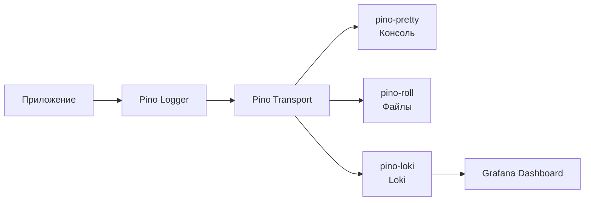

# Руководство по множественному логированию в IoT Hub

Этот проект поддерживает **одновременное использование трех способов логирования**:

1. **Консольный вывод** с красивым форматированием (pino-pretty)
2. **Файловое логирование** с ротацией (pino-roll)
3. **Centralized логирование** через Loki (pino-loki)

## 🔧 Конфигурация

### Переменные окружения

```bash
# Основные настройки логирования
LOG_LEVEL=info                      # debug, info, warn, error
LOG_TO_FILE=true                    # Включить файловое логирование
LOG_FILE_PATH=./logs/app.log        # Путь к файлу логов
LOG_FILE_MAX_SIZE=10M               # Максимальный размер файла
LOG_FILE_MAX_FILES=5                # Количество ротируемых файлов

# Расширенные настройки
LOG_FORMAT=json                     # json, pretty
LOG_ENABLE_METADATA=true            # Метаданные (requestId, userId)
LOG_ENABLE_REQUEST_LOGGING=true     # HTTP запросы/ответы
ENABLE_FILE_LOGGING_IN_DEV=false    # Файлы в development режиме

# Loki (централизованное логирование)
LOKI_ENABLED=false                  # Включить Loki
LOKI_URL=http://localhost:3100      # URL Loki сервера
LOKI_LABELS=service=iot-hub-backend,version=1.0.0  # Дополнительные метки
LOKI_TIMEOUT=30000                  # Таймаут запросов (мс)
LOKI_SILENCE_ERRORS=true            # Не падать при недоступности Loki
```

## 🚀 Быстрый старт

### 1. Запуск только с консольным выводом (минимальная настройка)

```bash
# Только основные переменные
export LOG_LEVEL=info
export LOG_TO_FILE=false
export LOKI_ENABLED=false

npm run start:backend
```

### 2. Консоль + файловое логирование

```bash
export LOG_LEVEL=info
export LOG_TO_FILE=true
export LOG_FILE_PATH=./logs/app.log
export LOKI_ENABLED=false

npm run start:backend
```

### 3. Все три способа одновременно

```bash
# Запуск Loki стека
docker-compose -f docker-compose.loki.yml up -d

# Настройка переменных
export LOG_LEVEL=info
export LOG_TO_FILE=true
export LOKI_ENABLED=true
export LOKI_URL=http://localhost:3100

npm run start:backend
```

## 📊 Мониторинг логов

### Консольные логи

Логи выводятся в терминал с красивым форматированием:

```
[2024-06-27 15:30:45] INFO: Server started on port 3000
[2024-06-27 15:30:46] INFO: Database connected successfully
```

### Файловые логи

Логи сохраняются в JSON формате с автоматической ротацией:

```json
{
  "level": 30,
  "time": "2024-06-27T15:30:45.123Z",
  "msg": "Server started",
  "service": "iot-hub-backend"
}
```

### Loki + Grafana

1. Откройте Grafana: http://localhost:3001
2. Логин: `admin`, пароль: `admin123`
3. Перейдите в Explore → выберите Loki datasource
4. Используйте LogQL запросы:

```logql
# Все логи backend
{service="iot-hub-backend"}

# Логи с ошибками
{service="iot-hub-backend"} |= "ERROR"

# Логи конкретного устройства
{service="device-simulator", device_id="test-device-001"}

# Логи за последний час с фильтром
{service="iot-hub-backend"} |= "mqtt" | json | level="error"
```

## 🔧 Как это работает

### Архитектура логирования



### Условная активация транспортов

1. **Консоль**: Всегда активна
2. **Файлы**: Активна если `LOG_TO_FILE=true` И (`production` ИЛИ `ENABLE_FILE_LOGGING_IN_DEV=true`)
3. **Loki**: Активна если `LOKI_ENABLED=true` И `LOKI_URL` установлен

### Используемые пакеты

- `nestjs-pino` - NestJS интеграция с Pino
- `pino` - Быстрый JSON логгер
- `pino-pretty` - Красивое форматирование для консоли
- `pino-roll` - Файловое логирование с ротацией
- `pino-loki` - Отправка логов в Loki

## 🎯 Рекомендации по использованию

### Для разработки

```bash
LOG_LEVEL=debug
LOG_TO_FILE=false
LOKI_ENABLED=false
```

Только консольный вывод для быстрой отладки.

### Для тестирования

```bash
LOG_LEVEL=info
LOG_TO_FILE=true
LOKI_ENABLED=true
```

Консоль + файлы + Loki для полного покрытия.

### Для продакшена

```bash
LOG_LEVEL=warn
LOG_TO_FILE=true
LOKI_ENABLED=true
LOKI_SILENCE_ERRORS=true
```

Все способы с фокусом на критических событиях.

## 🐛 Устранение неполадок

### Loki недоступен

Если Loki сервер недоступен, приложение продолжит работу благодаря `LOKI_SILENCE_ERRORS=true`.

### Проблемы с файлами

Убедитесь, что директория `./logs` доступна для записи:

```bash
mkdir -p ./logs
chmod 755 ./logs
```

### Большие файлы логов

Настройте ротацию:

```bash
LOG_FILE_MAX_SIZE=5M
LOG_FILE_MAX_FILES=10
```

## 🔄 Интеграция с CommonConfigService

Вся конфигурация логирования управляется через `CommonConfigService`:

```typescript
// Получение конфигурации логирования
const loggingConfig = commonConfig.getLoggingConfig();
const lokiConfig = commonConfig.getLokiConfig();

// Проверка состояния
if (commonConfig.isProduction()) {
  // Продакшн настройки
}
```

Это обеспечивает централизованное управление и валидацию всех настроек логирования.
